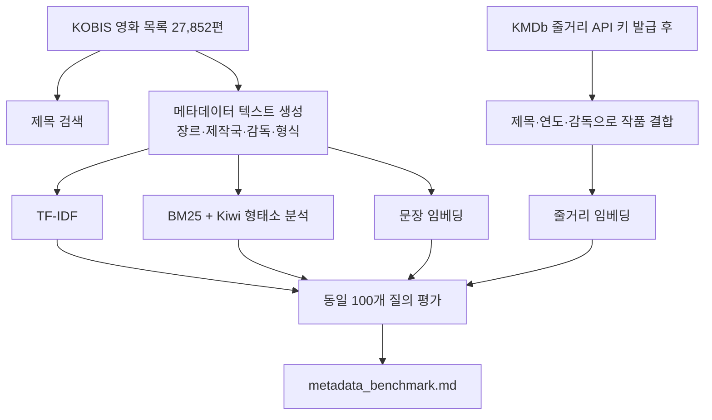

# 개발 흐름과 성능 비교

## 현재 단계

1. KOBIS의 2000~2025년 개봉 목록 27,852편을 저장했다. 성인물도 제외하지 않는다.
2. 제목 검색은 전체 카탈로그에서 한다.
3. KOBIS가 제공하는 장르·제작국·감독·형식을 한 문장으로 만들고, 전체 작품에 문장 임베딩을 계산한다.
4. 같은 입력과 같은 후보군으로 TF-IDF, BM25, 문장 임베딩을 평가해 기준선을 만든다.

## 현재 비교의 의미

세 방식 모두 줄거리가 아니라 KOBIS 메타데이터를 입력으로 쓴다. 정답은 “두 영화가 장르를 하나 이상 공유하는가”로 임시 정의한다. 따라서 Precision@10과 nDCG@10은 메타데이터를 얼마나 일관되게 묶는지의 수치이지, 영화 내용이 비슷한지를 보장하는 수치가 아니다.

- **TF-IDF**: 단어가 특정 영화에 드물게 등장할수록 높은 가중치를 주는 단어 벡터 방식이다.
- **BM25**: TF-IDF 계열의 검색 점수 방식이다. 같은 단어가 반복돼도 점수가 무한히 커지지 않게 조절하고, 문서 길이 차이도 보정한다.
- **문장 임베딩**: 문장을 숫자 벡터로 바꾸고 코사인 유사도로 비교한다. 단어가 달라도 문맥이 비슷하면 가까워질 수 있다.
- **Precision@10**: 추천 상위 10편 중 장르가 겹친 작품의 비율이다.
- **nDCG@10**: 관련 작품이 상위에 있을수록 더 높은 점수를 주는 순위 품질 지표다.
- **후보 다양성@10**: 모든 질의의 상위 10개에 얼마나 다양한 영화가 등장했는지다. 너무 낮으면 인기·유명 감독 작품만 반복 추천하는 경향을 뜻한다.

## KMDb 줄거리 결합 뒤

1. KOBIS 영화 코드가 아닌 제목·제작연도·감독을 함께 비교해 KMDb 작품을 결합한다.
2. 결합이 확실한 작품의 줄거리만 별도 저장한다. 애매한 동명 작품은 자동 결합하지 않는다.
3. 줄거리로 새 문장 임베딩을 만들고, 현재 메타데이터 임베딩과 별도로 보관한다.
4. 같은 100개 질의와 같은 지표로 다시 측정한다.
5. 수치가 올랐는지뿐 아니라, 기생충·인터스텔라 같은 대표 영화의 추천 상위 목록을 사람이 함께 검토한다. 자동 장르 지표만으로는 줄거리 품질을 완전히 판정할 수 없기 때문이다.
